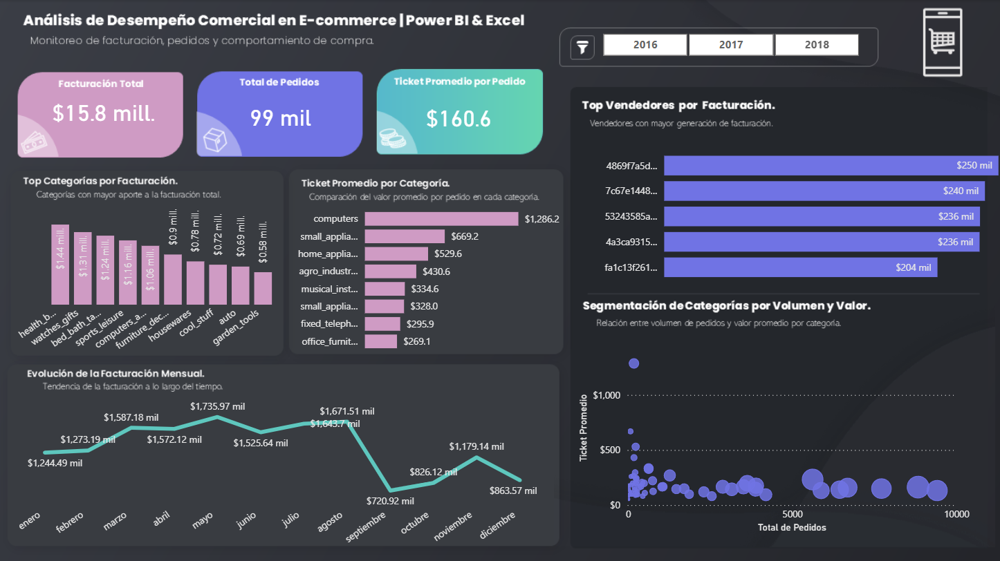

# 📊 Análisis de Desempeño Comercial en E-commerce

<p align="center">


</p>

---

## 🚀 Transformando datos comerciales en decisiones

Solución de **Business Intelligence** desarrollada en **Power BI**, enfocada en analizar el desempeño comercial de un e-commerce mediante la integración, transformación y análisis de datos de pedidos, productos, categorías y vendedores.

El proyecto procesa aproximadamente **99 mil pedidos** y **$15.8 millones en facturación**, centralizando los principales indicadores comerciales en un dashboard ejecutivo interactivo.

---

## 📷 Vista General

<p align="center">



</p>

---

## 🎯 Objetivo del Proyecto

Desarrollar una solución analítica que permita responder preguntas clave del negocio:

- ¿Cómo evoluciona la facturación a lo largo del tiempo?
- ¿Qué categorías generan mayor facturación?
- ¿Qué categorías tienen mayor ticket promedio?
- ¿Qué vendedores presentan mejor desempeño?
- ¿Qué relación existe entre volumen de pedidos y valor por compra?

---

## 📊 Dashboard

El dashboard permite analizar diferentes dimensiones del desempeño comercial:

### 💰 Facturación

- Facturación Total: **$15.8 millones**
- Evolución mensual de la facturación
- Facturación por categoría
- Análisis de tendencias

### 📦 Pedidos

- Total de pedidos: **99 mil**
- Ticket promedio: **$160.6**
- Volumen de pedidos por categoría
- Relación entre volumen y valor

### 👨‍💼 Vendedores

- Ranking de vendedores por facturación
- Comparación del desempeño comercial
- Identificación de principales vendedores

### 🛍️ Categorías

- Categorías con mayor facturación
- Ticket promedio por categoría
- Segmentación según volumen y valor

---

## 🔍 Principales Insights

- Las categorías con mayor volumen de ventas **no necesariamente generan el mayor valor por pedido**.
- Se identificaron categorías con **alto ticket promedio y bajo volumen**, representando oportunidades potenciales de crecimiento.
- La facturación presenta variaciones a lo largo del año que pueden ser consideradas para la planificación comercial.
- El análisis permite comparar el desempeño de vendedores y categorías para identificar oportunidades de optimización.

---

## 🛠️ Tecnologías

| Herramienta | Uso |
|---|---|
| **Power BI** | Dashboard y visualización |
| **Power Query** | ETL, limpieza y transformación |
| **DAX** | KPIs y medidas calculadas |
| **Excel** | Fuente y procesamiento de datos |
| **Data Modeling** | Modelo analítico |

---

## ⚙️ Proceso Analítico

El proyecto siguió un flujo **end-to-end de análisis de datos**:

**Fuentes de datos → Power Query → Limpieza y transformación → Modelo de datos → DAX → Dashboard → Insights de negocio**

Se realizaron procesos de:

- Integración de múltiples fuentes.
- Limpieza y transformación de datos.
- Normalización y preparación de tablas.
- Modelado de datos en Power BI.
- Creación de medidas y KPIs mediante DAX.
- Diseño de dashboard ejecutivo.
- Análisis e interpretación de resultados.

---

## 📈 Principales KPIs

- **$15.8M** Facturación Total
- **99K** Pedidos
- **$160.6** Ticket Promedio
- Facturación mensual
- Facturación por categoría
- Ranking de vendedores
- Ticket promedio por categoría
- Volumen de pedidos por categoría

---

## 📁 Estructura del Proyecto

```text
ecommerce
│
├── data
│   ├── ecommerce_analysis_isbeth.xlsx
│   ├── olist_customers_dataset.csv
│   ├── olist_order_items_dataset.csv
│   ├── olist_orders_dataset.csv
│   ├── olist_products_dataset.csv
│   └── product_category_name_translation.csv
│
├── images
│   └── ecommerce_dashboard.png
│
├── pbix
│   └── ecommerce_dashboard.pbix
│
├── LICENSE
├── README.md
└── .gitignore

```

---
## 💡 Aprendizajes

Este proyecto permitió fortalecer habilidades en:

- Business Intelligence
- Power BI
- Power Query
- DAX
- ETL
- Modelado de Datos
- Análisis Comercial
- Data Storytelling
- Diseño de Dashboards Ejecutivos

---

## 📄 Licencia y Datos

Este proyecto se encuentra bajo la **MIT License**.

El análisis, modelo de datos, medidas DAX y visualizaciones fueron desarrollados por **Isbeth Hernández**.

Los datasets utilizados provienen de fuentes externas y se incluyen únicamente con fines educativos y de análisis. Los derechos sobre los datos corresponden a sus respectivos autores y fuentes originales.

Consulta el archivo [`LICENSE`](LICENSE) para conocer los términos de uso.

---

## 👩‍💻 Autora

### Isbeth Hernández

**Data Analyst | Business Intelligence**

- 💼 [LinkedIn](https://www.linkedin.com/in/isbeth-andrea-hernández-soto-/)
- 💻 [GitHub](https://github.com/isbethahs)
- 🌐 [Portafolio](https://isbethhernandezsoto.lovable.app)

---

**© 2026 Isbeth Hernández**

⭐ Si este proyecto te resulta interesante, no olvides darle una estrella al repositorio.